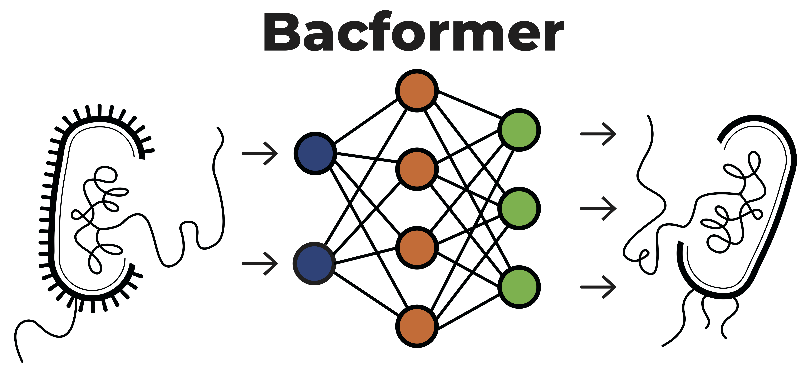
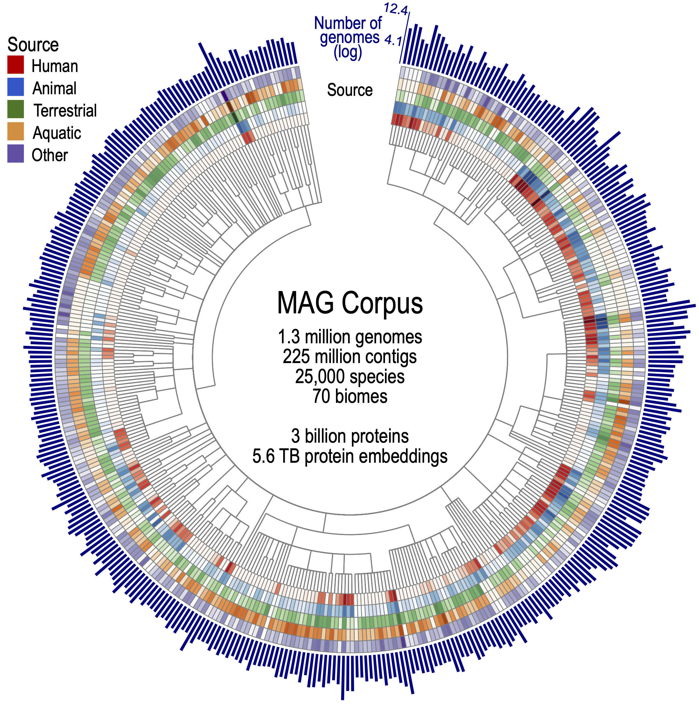
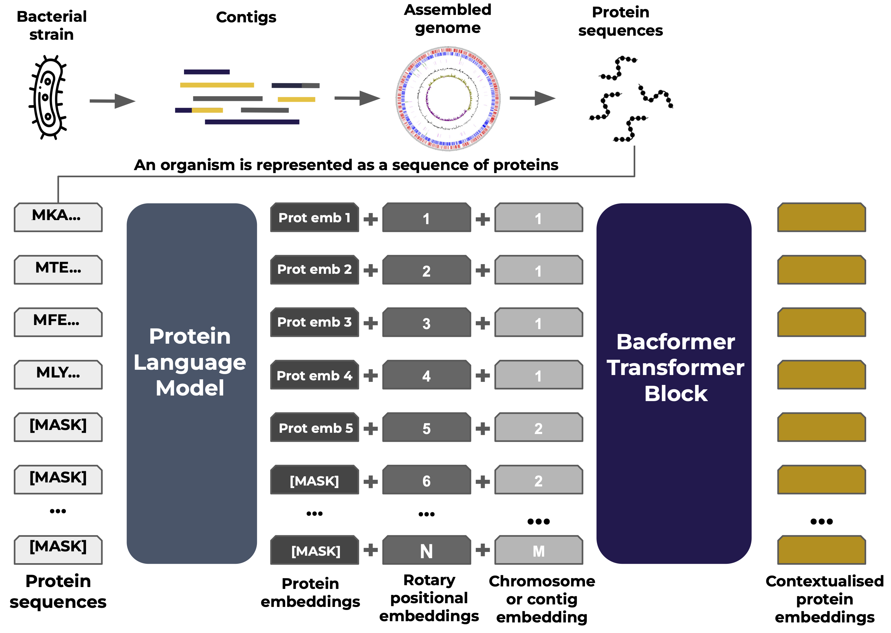
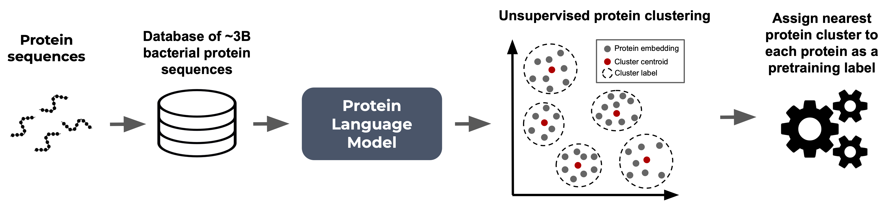
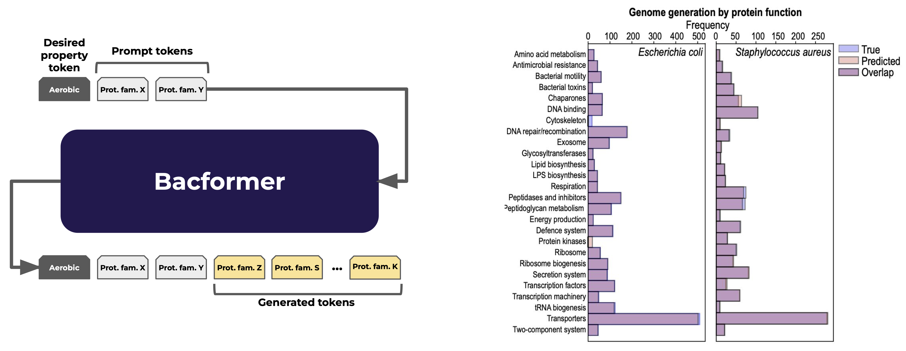

## Bacteria – Small Cells, Big Impact

Bacteria are among the most successful and abundant organisms on Earth. They inhabit virtually every environment – from deep oceans and soil to the insides of our bodies – playing crucial roles in ecology, human health, and biomanufacturing. Despite being surrounded by bacteria, our understanding of bacterial genomics has been limited, traditionally biased toward a few well-studied disease-causing types of bacteria. This leaves a vast wealth of genomic diversity and evolutionary innovation largely unexplored.

### Why Bacteria Are an Ideal Playground for Machine Learning

One reason bacteria present such an exciting opportunity is that they are far more tractable for genomics modeling than complex multicellular life like humans. A single bacterium is a self‑contained, organism consisting of just a single cell, with a relatively small genome (millions of DNA base pairs vs. billions in humans) that is densely packed with genes. There are only very short gaps between genes (unlike introns or large “junk DNA” regions in human genomes) – most of a bacterial genome directly encodes proteins, nor do bacteria require modeling an elaborate epigenome or many cell types to understand genomic function. In short, bacterial genomes are compact and packed with information that can be systematically decoded by modern machine‑learning methods. Thanks to advances in DNA sequencing, we have collected and curated 1.3 million bacterial genomes from many environments. This makes bacteria a perfect playground to apply ML algorithms, potentially allowing us to learn the “language” of genomes the way large language models have learned human languages.

## Beyond Single Species: Toward a Foundation Model for Bacteria

Until now, most computational models in microbiology have focused on single species of bacteria or specific problems. For example, researchers have built predictors for antibiotic resistance or metabolism in Escherichia coli or Staphyloccus aureus, but these models often struggle to generalize beyond the species they were trained on. A key challenge is that bacteria are incredibly diverse – a microbe from a marine environment can be as genetically different from a human gut bacterium as a plant is from an animal. How could one model possibly handle the full spectrum of bacterial diversity?

Interestingly, despite their diversity, bacterial genomes share common structural principles. For instance, they reuse large, conserved protein families that recur across diverse bacterial species, and they organize many of their genes into operons – groups of neighbouring genes transcribed together that typically encode functionally related proteins. Genes which are close to each other on the genome often regulate each other, and even the relative location of the gene on the genome has functional implications. These patterns which are shared across bacterial species suggest an underlying syntax for how bacterial genomes are organized. If a model could learn this genomic “grammar” in a general way, it might predict functions and interactions for any bacterium, even those never seen before.

This is the motivation behind Bacformer, a new foundation model for bacterial genomics. Bacformer isn’t limited to one species or one task – it aims to absorb evolutionary and functional rules from all of bacteria. By training on genomes from across the bacterial tree of life, Bacformer can capture signals that are impossible to glean from any single‑species dataset. The result is a model that can be applied universally to bacterial genomics questions, from identifying operons and essential genes to predicting phenotypes and potentially even designing entirely new genomes. It’s like upgrading from a pocket phrasebook to full language proficiency– except the language is written in DNA and proteins.

### A Training Corpus Spanning the Bacterial Tree of Life

To allow our model to learn the grammar of every microbe, we assembled a corpus of bacterial tree of life: over 1.3 million genomes (mostly metagenome-assembled) covering ~25 000 species from more than 70 habitats—soils, oceans, hot springs, human and animal microbiomes, and many places in between—together encoding almost ~3 billion proteins. This breadth corrects long-standing taxonomic and ecological biases in public databases, ensuring Bacformer encounters an evolutionary spectrum rather than memorising a handful of disease causing bacteria. By learning from bacteria across diverse habitats, the model gains a panoramic view of genome diversity and can generalise its predictions across distant lineages, environments, and lifestyles.

## The Bacformer Architecture: Encoding Genomes as Sequences of Proteins

How do you feed an entire genome into a machine‑learning model? Bacformer introduces a clever representation: instead of using DNA sequences directly (which can be extremely long with over 6 million base pairs), it focuses on the proteins that the genome encodes. Each bacterial genome is broken down into its list of protein sequences. Think of this as taking the genome’s “words” to be the proteins rather than the ATCGs in the DNA . This has a few advantages: proteins are the functional units (so their sequences are very informative), and protein sequences are short (genes average a few hundred amino acids, compared to a whole genome, which consists of millions of bases). Moreover, proteins have well conserved patterns (motifs, domains) that can be captured by protein language models.

Bacformer builds on top of previous  protein language modeling by using  condensed representations of the protein’s properties and evolutionary relationships so called embeddings. Each protein sequence is passed through aprotein language model (here, ESM‑2) to produce such an embedding. Once every protein in a genome is converted to an embedding, Bacformer orders these vectors according to their genomic positions and feeds the sequence into a genome‑level transformer. Special tokens mark chromosome or plasmid boundaries, while rotary positional embeddings encode each protein’s exact location, ensuring the model preserves true genome architecture and gene order**.** These protein tokens are then used as input to Bacformer’s transformer, which learns the contextual relationships between proteins across the genome.

#### Pretraining on Protein Families: Learning Genomic Syntax

During pretraining, Bacformer predicts the protein family labels based on the other proteins in the genome, effectively teaching the model the evolutionary and functional rules that tie genes together. Thus, allowing the model to capture how proteins cooperate and co‑evolve within a genome. This architecture effectively contextualizes protein function: a protein in isolation might be involved in various processes, but when Bacformer sees it alongside its neighbours and the wider genomic backdrop, it can infer far more about its role.

Unlike DNA or protein‑based language models that rely on pre‑defined token dictionaries, Bacformer accommodates the vast diversity of possible proteins by grouping similar proteins into 50,000 distinct protein clusters (to which we refer to as protein families) and using these family labels as a discrete vocabulary for pretraining. Predicting the family rather than the exact sequence makes the task tractable while still forcing the model to learn meaningful associations—operon partners, pathway components, regulatory pairs, and more. Over time, Bacformer internalises a functional syntax: if the first steps of a metabolic pathway appear, the downstream enzymes are expected to follow—just as grammar constrains which words can logically appear next in human language.

## Leveraging whole-genome context for functional genomics tasks

Bacformer can be adapted to a wide range of tasks in bacterial genomics. Remarkably, even without additional training (in a “zero-shot” setting), Bacformer’s learned representations already unlock strong performance on several fundamental problems:

- **Operon detection** – simply by looking at the learned embedding representations of neighboring genes, Bacformer can predict which genes form operons (co-transcribed units).
- **Protein-protein interaction prediction** – henome-scale embeddings let us compute similarity between every protein pair, recovering known interaction networks and pathway partners across species.
- **Essential gene prediction & protein function annotation** – a short fine-tune with essential-gene labels boosts accuracy to ~0.9 AUROC, and the same whole-genome context delivers a > 7 % gain in protein-function annotation.
- **Phenotype inference** – vlassifiers built on Bacformer embeddings predict 139 traits (motility, sporulation, temperature range, nutrient use, etc.) more accurately than non-contextual models, while saliency highlights candidate genes linked to each phenotype.

It’s noteworthy that Bacformer achieved all the above without explicit prior knowledge of these concepts. Operons, interactions, essential genes, metabolic traits—the model inferred signals for each from the raw genome sequences during pretraining.

To validate our results, we conducted long-read RNA sequencing for multiple distinct bacteria to verify the operon structures predicted with Bacformer, showing remarkable zero-shot performance across species.

### Towards designing bacterial genomes with desired properties

The ability to aid the design of an entire genome for a particular trait could catalyse metabolic engineering and biomanufacturing, enabling us to engineer microbes that efficiently produce medicines, biofuels, and new materials with far less trial-and-error. Bacformer demonstrated the capability to learn the underlying genomic syntax, therefore, we evaluated its generative capabilities by prompting the pretrained generative model with a set of 500 proteins. Bacformer generated a sequence of protein families spanning multiple essential protein functions and resembling the distribution of real genomes. Pushing further, we fine‑tuned Bacformer with a single conditioning token—such as “anaerobe”—and asked it to complete the genome. The resulting sequences of protein families were markedly enriched in protein families associated with the trait, such as fermentation enzymes and depleted of oxygen‑dependent pathways, showing that the model can bias its designs toward a desired physiological niche. These proofs‑of‑concept hint how Bacformer coule be used for AI‑assisted genome design pipelines, though plenty of wet‑lab validation and safety governance still stand between today’s in‑silico blueprints and engineered production strains.

## Outlook: Foundation Models for Microbial Discovery

Bacformer demonstrates that by learning the “language” of bacterial genomes, we can unlock a wealth of biological insight. This single model encapsulates billions of years of bacterial evolution, and in doing so, it provides a powerful tool to predict what bacterial genes do, how they interact, and how genomes are organized. The ability to generalize across species means Bacformer can shed light on less studied organisms, leveling the playing field in genomics. We hope that Bacformer and future work will accelerate microbial discovery, from finding new drug targets (essential genes or pathways) to identifying novel enzymes for biotech, or diagnosing traits of an unknown microbe from its genome.

## Getting Started with Bacformer

Preprint:

Code & tutorials: [https://github.com/macwiatrak/Bacformer](https://github.com/macwiatrak/Bacformer)

Pretrained model weights: [https://huggingface.co/macwiatrak](https://huggingface.co/macwiatrak)
